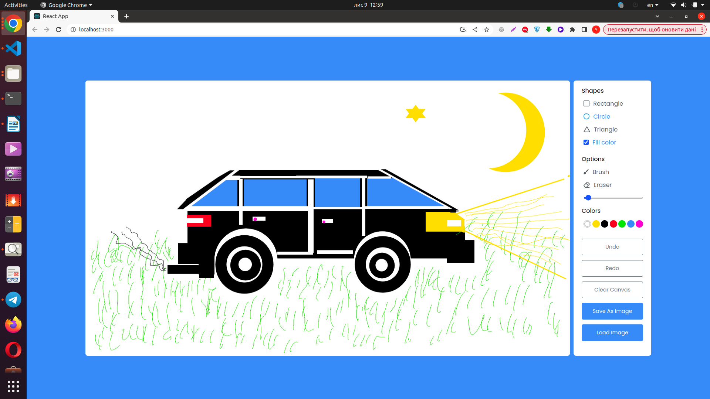

# Getting Started with Create React App

This project was bootstrapped with [Create React App](https://github.com/facebook/create-react-app).

## Available Scripts

In the project directory, you can run:

### `npm start`

## Screenshot Example

## Screenshot Example

Прошу не обращать внимание на реализацию, я переделывал проект несколько раз и в итоге из-за нехватки времени 
заколотил его при помощи костылей и засунул в CRA.

Что касается общей логики проекта: 
С ростом возможностей, принимать решение, что мы делаем (рисуем треугольник, круг, линию) в одной функции
является не совсем верным. Когда добавляеш возможность не только рисовать те или иные объекта, а и 
изменять их впоследствии и в частности перетаскивать то нужна другая структура.

Необходимая структура(иерархия):

    Canvas - настройки Канвас передаваемые сверху (размер полотна и т.д.)
        Dashboard - общая структура куда подключаются разные компоненты (ImageUploader, ImageSave, TextBoard, BrushBoard...)
            Components - Каждый из компонентов содержит свои функции навешиваемые на прослушивание событий Канваса только 
            на время использования возможностей этого компонента и удаляются при использовании функций другого компонента.
            Логика навешиваемых слушателей находится в каждом конкретном компоненте, а не например в отдельном Хуке.

Переделанную версию с кодом без костылей, с использованием кастомной сборки Вебпака, с подключением различных тестов и т.д.
могу сделать немного попозже.